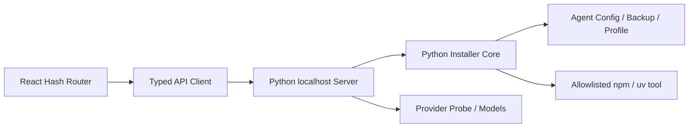

# OneAgent React 前端实现与发布门禁

## 文档状态

- 状态：React 七页 GUI、Python API、安全边界和本机浏览器验收已实现。
- 更新日期：2026-07-27。
- 本机验证：macOS arm64。
- 门禁状态（按 [ADR-005](decisions/ADR-005-channel-neutral-distribution-and-compliance.md) 更新）：四平台目标系统 CI 已实现，但不再要求同时齐备；每个实际发布平台仍须原生构建并有 cleanroom 验收证据。仍未完成：五个真实 Agent 安装、PPIO/Novita 真实协议请求（`release-candidate.yml` 已定义但尚未运行）。macOS/Windows 签名属于仍然有效的 Stable 门槛，当前阶段不走 Stable。
- 架构依据：[ADR-003](decisions/ADR-003-three-platform-python-core-and-release-policy.md)。

本文不再描述尚未开始的 React 迁移，而是固定当前实现、组件边界、测试口径和后续发布条件。

## 当前技术栈

| 层 | 实现 | 锁定版本/约束 |
| --- | --- | --- |
| UI | React + TypeScript | React `19.2.8`，TypeScript `7.0.2` |
| 构建 | Vite | `8.1.5`，生产 source map 关闭 |
| 路由 | React Router Hash Router | `7.18.1` |
| 状态 | `useReducer` + Context + secret ref | Key 不进入 reducer |
| 图标 | `lucide-react` | `1.25.0`，不伪造 Agent Logo |
| 单元测试 | Vitest + Testing Library | Vitest `4.1.10` |
| E2E | Playwright Chromium | `1.61.1` |
| 本地服务 | Python 3.12 标准库 HTTP Server | 仅监听 `127.0.0.1` |
| 安装执行 | `oneagent.installer` | Bash/PowerShell/GUI 共用 |
| 发行 | PyInstaller onedir | `6.21.0`，目标系统原生构建 |

终端用户运行打包版不需要 Node.js 或系统 Python。源码入口要求 Python 3.12+；前端开发要求 Node.js 22。

## 运行架构



职责边界：

- React 只维护流程、表单、非敏感状态和最终结果。
- API Key 只存在于密码输入 DOM、`useRef` 和当前请求体中。
- Python 负责输入校验、Provider URL、安装、备份、配置合并、权限、脱敏和 profile。
- Bash 与 PowerShell 只做 Python 版本检查和参数转发。
- guide-only Agent 不进入自动安装和私有配置适配器。

## 实际目录结构

```text
frontend/
  index.html
  package.json
  package-lock.json
  vite.config.ts
  playwright.config.ts
  e2e/
    wizard.spec.ts
  src/
    main.tsx
    App.tsx
    api/
      client.ts
      client.test.ts
    components/
      AppWindow.tsx
      NavigationSidebar.tsx
      PageScaffold.tsx
      SetupStepper.tsx
      AgentRow.tsx
      ChoiceRow.tsx
      ProviderSegment.tsx
      SecureKeyField.tsx
      ConnectionStatus.tsx
      ModelPicker.tsx
      ReviewGroup.tsx
      AgentProgressRow.tsx
      LogDisclosure.tsx
      EnvironmentSummary.tsx
      StatusBadge.tsx
    pages/
      AgentSelectionPage.tsx
      ConfigModePage.tsx
      ProviderKeyPage.tsx
      ModelSelectionPage.tsx
      ReviewPage.tsx
      ActivationPage.tsx
      EnvironmentOverviewPage.tsx
    state/
      WizardContext.tsx
      wizardReducer.ts
      *.test.tsx
    styles/
      tokens.css
      base.css
      app.css
    types/
      api.ts
```

组件按职责拆分，七个页面没有重新合并进单一表单组件。路由守卫会阻止跳过 Agent、配置方式或模型选择的非法导航。

## 页面与状态

| 页面 | 主要组件 | 关键规则 |
| --- | --- | --- |
| Agent | `AgentRow`、分类折叠、安装开关 | Agent 多选；至少一个；展示 installed/configured/canInstall |
| 配置方式 | `ChoiceRow` | Provider 模式或 existing-account；后者跳过步骤 3、4 |
| Provider/Key | `ProviderSegment`、`SecureKeyField`、`ConnectionStatus` | PPIO/Novita/Custom；注册入口；Key 不持久化 |
| 模型 | `ModelPicker` | `/v1/models` 成功选首项；失败回退手动输入 |
| 确认 | `ReviewGroup` | 展示实际路径、备份、Provider、模型和 guide-only 项 |
| 执行 | `AgentProgressRow`、`LogDisclosure` | 同步请求显示不定进度；按 Agent 最终状态；失败项单独重试 |
| 总览 | `EnvironmentSummary` | 从无 Key 的 profile 恢复 Provider、模型和 Agent 摘要 |

`WizardState` 只保存：Agent、配置方式、Provider ID、Custom URL、是否存在 Key、模型、连接状态、模型列表和安装结果。它不保存 Key 内容。

单 Agent 重试通过 `profile_agents` 把完整选择集合传给 Python，避免重试成功后覆盖之前已完成 Agent 的环境摘要。

## 视觉与响应式

- 浅色 Native Utility Split View；标题栏 52px，桌面侧栏 232px，底部操作区 64px。
- 页面背景 `#F5F5F7`，主表面 `#FFFFFF`，系统蓝 `#007AFF`，成功绿 `#34C759`。
- 控件圆角 6px，分组 8px，窗口 12px；不使用营销 Hero、装饰渐变球或卡片堆叠。
- 字体使用系统字体栈，`letter-spacing: 0`，字号不随 viewport 宽度缩放。
- 日志默认折叠，只有展开后使用深色代码材质。
- 支持 `prefers-reduced-motion` 和可见键盘焦点。

验收 viewport：

| Viewport | 结果 |
| --- | --- |
| 1440×900 | 七页通过，无横向溢出 |
| 1280×800 | 七页通过，无横向溢出 |
| 1024×720 | 七页通过，侧栏收窄，主内容独立滚动 |

当前不提供手机布局，最低支持窗口为 1024×720。

## API 与本地安全边界

- `GET /api/status`：无需会话，返回 `apiVersion`、平台、能力、catalog、路径和可选 environment。
- `POST /api/probe`：Chat Completions 最小请求。
- `POST /api/models`：模型列表和手动输入回退。
- `POST /api/install`：同步执行，返回 per-agent result。
- `POST /api/open-register`：仅允许 PPIO/Novita 和已知 Agent ID。

首页设置随机 HttpOnly、SameSite=Strict Cookie，Path 限定 `/api`。所有 POST 必须同时满足：

1. Cookie 与当前 Server token 一致。
2. `Origin` 为当前端口的 `127.0.0.1` 或 `localhost`。
3. JSON body 不超过 64 KiB，字段类型严格匹配。

静态服务：

- 路径先 URL decode、规范化并验证仍位于 `frontend/dist`。
- 拒绝 `..`、NUL、目录列表和未知 MIME。
- `index.html` 为 `no-store`；Vite hash asset 为一年 immutable cache。
- CSP 只允许同源脚本、样式、字体和连接；无 CDN、远程字体或内联脚本。
- 构建缺失时返回本地 503 提示，不从互联网下载资源。

## 密钥与文件系统

- Key 不进入 URL、命令行、日志、profile、Reducer、localStorage/sessionStorage、截图文件名或遥测。
- React 完成成功激活后清空 secret ref；日志显示前再次执行当前 Key 精确替换。
- Unix 私有目录 `0700`，密钥目标、临时文件和备份 `0600`。
- Windows 对目录、临时文件、目标和 secret backup 重置 ACL、关闭继承，仅授予当前用户和 SYSTEM。
- ACL 或 mode 设置失败时，临时密钥在发布前删除；无法清理会返回 `CONFIG_WRITE_FAILED`。
- `profile.json` 只保存 schema、Provider、Base URL、模型、配置模式、Agent ID 和激活时间。

## Provider 与 Agent 协议

- OpenCode、Kilo CLI、Aider 使用 OpenAI-compatible base。
- Claude Code 对 PPIO/Novita 使用各自 `/anthropic` base；Custom 显式覆盖由用户负责协议兼容。
- Codex `wire_api` 使用 Responses。PPIO/Novita 的 Responses 支持必须由 RC 真实 Key 测试确认，不能由 Chat Completions 探测替代。
- 单一模型 ID 跨 OpenAI、Anthropic、Responses 的兼容性不是既定事实，发布验收必须启动真实 Agent 做首次请求。

## 自动测试现状

本机当前基线：

- Python：63 项测试，整体分支覆盖 93%；`installer.py` 为 100% 分支覆盖，Windows 真实 ACL 测试在非 Windows 本机跳过。
- React：14 项单元测试；状态/API 层分支覆盖 85%。
- Playwright：6 项 E2E。
- 完整七页：三个 viewport。
- existing-account 跳过路径：通过。
- 部分失败与单 Agent 重试：通过。
- 浏览器存储保持空，sentinel Key 在激活后从 DOM 消失。
- Bash CLI 和 GUI smoke：纳入最终回归。

Vitest 只收集 `src/**/*.test.{ts,tsx}`；`frontend/e2e` 只由 Playwright 执行，避免测试运行器交叉加载。

## CI 与发行

普通 CI 矩阵：

- `macos-15`：macOS arm64。
- `macos-15-intel`：macOS x64。
- `windows-2022`：Windows x64。
- `ubuntu-22.04`：Linux x64。

每个平台执行 Python contract、React coverage、生产构建和 Chromium E2E。Windows 额外执行 PowerShell wrapper 和真实 ACL 测试；Unix 执行 Bash/GUI 兼容测试。

技术预览工作流在目标系统构建 PyInstaller onedir，运行冻结 CLI smoke，并校验：

- 无 source map、`node_modules`、`output/`、coverage、Playwright 产物或 Agent 二进制。
- 无可识别 Key 或 Authorization secret。
- 包内有 lock manifest 和第三方许可证清单。
- 外部 release manifest、SHA-256 和 artifact size 与真实文件一致。

## 剩余 Release Candidate 门禁

以下项目不能在当前 macOS arm64 本机模拟为完成。按 [ADR-005](decisions/ADR-005-channel-neutral-distribution-and-compliance.md)，四平台不再要求同时齐备——每个实际发布的平台须满足适用于它的条目：

1. 每个实际发布的平台在对应操作系统原生生成并启动 onedir 产物。
2. 五个 Agent 在已发布平台从官方源安装锁定版本，并执行真实 `--version`（`release-candidate.yml` 已定义，CI Secret 未配置，尚未运行）。
3. Windows 使用空格路径、Unicode 用户名和真实 ACL 完成配置写入（仅在发布 Windows 产物时要求）。
4. PPIO、Novita 使用受保护低权限 Key 调用 `/v1/models`、最小 Chat Completions、Anthropic Messages 和 Codex Responses（尚未运行，见 README“仍未取得证据的部分”）。
5. 用生成配置启动五个真实 Agent，验证所选模型完成首次最小请求。
6. 发行 ZIP、manifest、SHA-256、许可证和 secret scan 全部通过。
7. 提升到 Stable 时额外完成 macOS 公证和 Windows Authenticode（`scripts/build_release.py` 产物级强制；当前阶段不走 Stable）。

如果 PPIO 或 Novita 不支持 Codex 当前要求的 Responses 协议，必须在发布前把该 Agent/Provider 组合降级为明确的不支持或 guide-only；不得通过未批准的本地协议网关掩盖问题。

开发期间允许使用 `apiproxy` 档案和 `openai/gpt-5.6-terra` 做 OpenAI、Anthropic、Responses 三协议的本地脚本预检，但它只验证测试工具链，不计入 PPIO/Novita 正式 RC 结果。`openai/gpt-5.6-luna` 只支持两类协议，不用于三协议统一预检。

## 开发命令

```bash
cd frontend
npm ci
npm run test:coverage
npm run build
npm run e2e
```

```bash
python3.12 -m coverage run --branch -m unittest \
  tests.test_core tests.test_cli tests.test_server \
  tests.test_release_policy tests.test_edge_cases tests.test_rc_scripts
python3.12 -m coverage report --fail-under=85
bash tests/install_test.sh
python3.12 tests/gui_smoke_test.py
```

```bash
python3.12 scripts/build_release.py --channel technical-preview-unsigned --source
python3.12 scripts/check_release.py release
```

## 完成定义

React 实现本身已经达到功能完成条件：七页、路由守卫、跳过配置、模型回退、部分失败、单 Agent 重试、环境摘要、三 viewport 和 secret ref 均已落地。

产品发行仍受门禁约束：每个实际发布平台须原生构建并有 cleanroom 验收证据，真实 Agent 与真实 Provider 协议验收须按上文 RC 门禁执行。从 `technical-preview-unsigned` 提升到 Stable 还须满足平台签名条件（macOS 公证、Windows Authenticode）。四平台不要求同时齐备（[ADR-005](decisions/ADR-005-channel-neutral-distribution-and-compliance.md)）。
