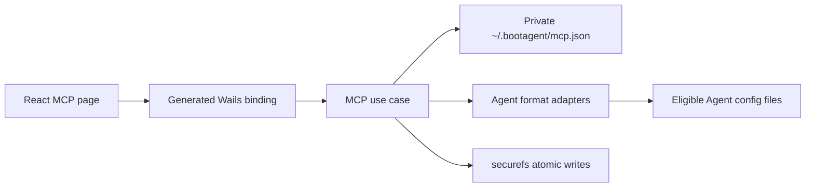

# MCP Registry Design

## Goal

Add a local MCP Registry that discovers existing MCP servers and lets the user
synchronize them across supported command-line Agents without blocking the MCP
page's first render. The Registry is the private, factual snapshot of what is
currently configured; edits remain an explicit, page-local draft until the
user selects **Apply changes**.

This design borrows cc-switch's useful boundary -- one normalized server model
with one adapter per Agent -- but does not copy its SQLite, preset, deep-link,
or compatibility layers. A private JSON file and the existing BootAgent write
pipeline are sufficient for this scope.

## Scope

The first release supports global user configuration for these Agents:

| Agent | Native MCP location | Native section |
| --- | --- | --- |
| Claude Code | `~/.claude.json` | `mcpServers` |
| Codex | `~/.codex/config.toml` | `mcp_servers` |
| OpenCode | the existing global `opencode.json` or `opencode.jsonc` | `mcp` |
| Kilo CLI | the existing global `kilo.jsonc`, `kilo.json`, or compatible OpenCode config | `mcp` |
| Hermes | the platform-resolved global `config.yaml` | `mcp_servers` |

Aider and OpenClaw remain outside this feature until they expose a stable MCP
configuration contract. Project-local MCP files, cloud synchronization,
filesystem watching, presets, server marketplaces, OAuth flows, and command
execution or health checks are also out of scope.

An Agent is eligible only when BootAgent can detect its command and its native
configuration root has already been initialized. Ineligible Agents are absent
from scans, filters, and target controls. Scanning never creates an Agent
directory. Applying may create the native configuration file inside an
already-existing eligible root.

## Architecture



- `internal/mcp` owns the normalized model, private JSON store, redaction,
  import/export envelope, and the five format adapters.
- `internal/app` owns scanning, conflict detection, Apply orchestration, and the
  existing process-wide write lock.
- `internal/binding` exposes one `MCPService`. React reaches the backend only
  through generated Wails bindings.
- `internal/catalog` remains the Agent metadata source of truth. The supported
  entries gain MCP adapter and global-path metadata; the frontend receives only
  the eligible projection, so the supported-Agent list is not duplicated in
  React.
- The MCP page owns draft state. No MCP server details or credentials enter the
  global status response, task state, browser storage, or logs.

The Registry lives at `~/.bootagent/mcp.json`. It is written with the existing
private-directory, backup, same-directory temporary file, permission-tightening,
and atomic-replace sequence. It contains credentials and therefore uses secret
file permissions and the same backup hardening rules as other BootAgent secret
stores.

An absent Registry is an empty Registry. Schema version 1 is the only writable
version in the first release; a newer or malformed file is reported as a
redacted diagnostic and is never overwritten automatically. A valid older
version is migrated in memory and atomically rewritten only after the user
initiates Apply or an explicit import/repair action.

## Registry Model

The on-disk schema starts at version 1 and records observed facts, not desired
targets:

```json
{
  "schema_version": 1,
  "servers": {
    "context7": {
      "variants": [
        {
          "agents": ["claude-code", "codex"],
          "spec": {
            "type": "stdio",
            "command": "npx",
            "args": ["-y", "@upstash/context7-mcp"],
            "env": {}
          }
        }
      ]
    }
  }
}
```

Each server ID has one or more variants. Agents with the same normalized spec
share a variant. More than one portable variant for an ID is a conflict; the
Registry preserves all variants and does not choose one automatically.

The portable server spec supports:

- `stdio`: `command`, ordered `args`, optional `env`, and optional `cwd`;
- `http` and `sse`: `url` and optional `headers`;
- an `extensions` object keyed by Agent ID for native fields that are not part
  of the portable model.

The structured editor changes portable fields. Advanced JSON exposes the full
canonical object. Unknown members are preserved in the draft, Registry, and
transfer file. Native-only members discovered by an adapter are stored under
that Agent's `extensions` entry and are projected only back to that format.
Unrelated native fields already present in a target file are always retained.

Object key order is insignificant, array order is significant, and an omitted
type with a command decodes as `stdio`. Empty optional fields are normalized
consistently before comparison. Server IDs must match
`^[A-Za-z0-9][A-Za-z0-9._-]{0,127}$` at every import and edit boundary.

Some native formats represent all URL transports as a generic `remote` entry.
They decode to `http` when first discovered. After BootAgent applies an `sse`
spec to such an Agent, subsequent scans first compare the native entry with the
projection of its recorded variant; an unchanged projection keeps the recorded
transport hint. A genuinely external change is decoded afresh. This prevents a
lossy native format from creating a false conflict on every scan.

## Background Scan

Entering the MCP page follows this sequence:

1. Render the page and start loading the existing redacted Registry summary.
2. After the initial React commit, start `Scan` without awaiting it as part of
   page initialization.
3. Show a small scanning indicator while keeping the table interactive.
4. Replace the summary with the returned snapshot when scanning finishes.

The same asynchronous scan runs on every later page entry. It is not run during
application startup and therefore adds no first-screen wait point.

For each eligible Agent, the scanner reads its native MCP section without
writing the Agent file:

- a new ID becomes a new Registry entry;
- an equal spec adds the Agent to the existing variant;
- a different portable spec adds a variant and marks a conflict;
- an externally deleted entry removes that Agent association, then removes an
  empty variant or server;
- native-only extension changes update that Agent's extension payload without
  producing a cross-format conflict;
- an unreadable or invalid file produces a redacted diagnostic and preserves
  the last known Registry facts for that Agent. A parse failure is never treated
  as deletion.

`Scan` and `Apply` use the existing BootAgent write lock so they cannot race each
other or other configuration mutations. Registry reads see either the old or
new complete file because writes are atomic.

If a scan completes while the user has a dirty draft, the new factual summary
is shown without replacing the draft. The page marks that its source changed.
The user's later Apply remains authoritative for IDs touched by that draft.

## Draft And Apply

Creating, editing, resolving a conflict, changing targets, deleting, and
confirming an import all modify only React component memory. Leaving the route,
reloading, or closing the native window with a dirty draft requires explicit
discard confirmation. There is no draft persistence.

React Router blocks in-app navigation. For a native close, React reports only a
non-secret dirty flag and locale to the backend. The desktop entry registers a
Wails `events.Common.WindowClosing` hook, cancels the first close, and shows a
localized question dialog. Confirming discard clears the flag and closes again.

One Apply request contains all touched server IDs, their canonical specs,
selected eligible targets, and deletions. The backend validates the complete
request before any write, then handles each target Agent independently:

1. Re-read the current native file.
2. Preserve all non-MCP content and all server IDs not touched by the request.
3. Unconditionally replace or delete the touched IDs according to the draft,
   even if those IDs changed after the last scan.
4. Atomically write the native file through `securefs` with secret permissions.
5. Update and atomically persist the Registry association for that successful
   Agent.

Successes remain applied when another Agent fails. The response reports every
Agent separately, and the page removes successful work from the draft while
keeping failed targets pending for retry. The Registry records only completed
associations.

There is no cross-file transaction between an Agent file and the Registry. If
the Agent write succeeds but the Registry write fails, the result reports
`config_updated: true` and `registry_updated: false`; the draft remains pending
and the next scan reconciles the factual Registry. BootAgent does not attempt a
risky rollback of an already-valid Agent configuration.

The page derives status from the factual snapshot and its draft: **synced** is
one variant with no pending edit, **conflict** is more than one variant,
**pending** is a dirty draft for that row, and **failed** is a target with a
retryable Apply result. Resolving a conflict means choosing or editing one
canonical variant and setting explicit targets; the choice is not persisted as a
desired state until Apply succeeds.

OpenCode and Kilo JSON/JSONC files are patched with
`github.com/tailscale/hujson`, preserving comments, trailing commas, and
untouched fields. Codex TOML, Claude JSON, and Hermes YAML use the repository's
existing structured parsers and atomic write path. No adapter builds config by
string concatenation.

## Security Boundary

The list and scan responses contain only IDs, transport labels, Agent
associations, conflict state, and `has_secrets` flags. Full specs are returned
only for an explicit detail/edit, import, or export action and remain in the
current MCP page component.

Values under `env`, `environment`, `headers`, and `http_headers`, plus nested
fields conventionally named `authorization`, `token`, `api_key`, `apikey`,
`client_secret`, or `clientSecret`, are sensitive. Summaries, differences,
diagnostics, errors, and logs redact their values. Secret differences may say
that a value changed but never show either value.

The Registry is private at rest but is not separately password-encrypted. It is
protected by BootAgent's private directory and file permissions. Encryption is
available for portable export files.

## Import And Export

MCP transfer uses a dedicated versioned JSON envelope. It includes selected
server IDs, their currently applied Registry variants, and actual Agent
associations. Current unsaved drafts are not exported. Imported target lists are
intersected with Agents eligible on the destination machine.

Export offers the same three credential modes as existing BootAgent transfers:

- **Omit secrets** is the default. Sensitive paths are listed in transfer
  metadata and their values are removed.
- **Encrypt secrets** password-encrypts the full server specs with PBKDF2
  SHA-256 and AES-256-GCM, using fresh random salt and IV values.
- **Plaintext** includes full specs only after an explicit warning.

The implementation reuses Go's standard `crypto/pbkdf2`, `crypto/aes`,
`crypto/cipher`, and `crypto/rand`; it does not add another cryptography
dependency. The envelope records algorithm parameters so it can be decoded
independently of UI state.

Import reads and validates the entire envelope before presenting a preview.
Nothing is written at preview time. For every colliding ID, the preview shows a
redacted difference and lets the user choose **Keep local**, **Use imported**,
or **Save as new ID**. Confirmed choices become the current page draft and still
require Apply.

**Save as new ID** requires a new valid ID and copies the imported spec without
touching the colliding local entry. Duplicate IDs inside one envelope and IDs
longer than 128 characters are rejected. Import input is capped at 4 MiB before
parsing to keep preview memory bounded.

For an omitted secret on an existing unambiguous local variant, import retains
the corresponding local value. An omitted secret on a new ID, or on an
unresolved local conflict, is marked missing and blocks Apply until supplied in
the editor. A wrong password or invalid authentication tag fails the preview
without exposing partial plaintext.

The existing `TransferService` supplies native open/save dialogs and file I/O;
the MCP service owns envelope validation, redaction, encryption, and decoding.

## Wails API

`MCPService` is added to `binding.Services` and exposes the smallest complete
surface:

- `List()`: return the current redacted Registry and eligible Agent summary;
- `Scan()`: rescan eligible Agents and return the updated redacted snapshot plus
  per-Agent diagnostics;
- `Get(serverID, sourceAgent)`: return one explicit full variant for editing;
- `Apply(request)`: apply all touched IDs and return one result per Agent;
- `Export(serverIDs, mode, password)`: create a transfer envelope string;
- `PreviewImport(data, password)`: validate and return the import preview;
- `SetDraftState(dirty, locale)`: maintain the non-secret native-close guard.

Import decisions need no backend mutation method: the preview already contains
the validated candidates, and confirmation changes only the page-local draft.
File reads and writes continue through `TransferService`.

Any backend DTO change is followed by Wails binding regeneration. Generated
files under `frontend/bindings` are never edited manually; the handwritten
adapter in `frontend/src/backend/wails.ts` and types in
`frontend/src/types/api.ts` are updated with the generated contract.

## UI

Add an **MCP Registry** navigation item and route. Its main view is a compact
table rather than a master-detail split:

- server ID and transport;
- currently associated eligible Agents;
- status: synced, conflict, pending, or failed;
- row actions for edit, resolve, export, and delete.

The toolbar contains search, Agent/status filters, background scan state, Add,
Import, Export, and Apply changes. Add/edit opens a modal with a structured
stdio/HTTP/SSE form, Agent target checkboxes, and an Advanced JSON tab. Conflict
resolution and import preview use focused modals. Unavailable Agents never
appear as disabled clutter.

Apply results stay visible per Agent. A partial failure does not erase a
successful result or the still-retryable draft. UI copy is authored as Chinese
i18n keys first and receives matching English translations.

## Failure Handling

- A single scan parse failure does not discard known data from any Agent.
- Invalid server IDs, malformed URLs, missing commands, non-string environment
  values, and unsupported native projections fail validation before that Agent
  is written.
- A native adapter error identifies the Agent and server ID but redacts paths or
  values that could contain credentials.
- Atomic-write or backup-permission failure leaves the prior destination file
  in place, following `securefs` guarantees.
- Import rejects unknown envelope kinds, unsupported schema versions, duplicate
  IDs, malformed encrypted payloads, and oversized input before creating a
  draft.
- Empty registries, no eligible Agents, scans in progress, conflicts, import
  errors, Apply failures, and retry states each have explicit UI states.

## Verification

Backend tests cover:

- each adapter's decode/project behavior using golden native configs;
- preservation of non-MCP content, unrelated IDs, JSONC comments, trailing
  commas, and native extensions;
- scan import, merge, conflict, external deletion, parse-failure retention,
  eligibility filtering, and lossy remote transport hints;
- full-request validation, authoritative touched-ID writes, partial success,
  Registry-write reconciliation, and concurrent Scan/Apply serialization;
- redaction, private permissions, all three export modes, wrong passwords,
  omitted-secret restoration, and import conflict decisions.

Frontend tests cover the non-blocking initial scan, table states, modal
structured/JSON round trips, local-only drafts, conflict resolution, import
preview, Apply partial success and retry, route blocking, and native dirty-state
reporting. Browser E2E covers one add-and-Apply flow and one conflict/import
flow through fake Wails bindings.

Before completion, regenerate Wails bindings and run the repository's Go, race,
vet, frontend, E2E, documentation, and release-compliance checks. Adding
`hujson` also requires updating `NOTICE` and regenerated third-party license
artifacts. User-visible behavior and paths are documented in both `README.md`
and `README_ZH.md` in the same change.

## Non-Goals

- Automatic writes during scan, edit, target toggling, or import confirmation.
- Persistent drafts, desired-state reconciliation, live filesystem watchers, or
  background daemons.
- Project-scoped MCP configuration, remote/cloud Registry storage, presets,
  server discovery marketplaces, OAuth token management, or MCP process health
  checks.
- Creating configuration roots for uninstalled or uninitialized Agents.
- Replacing complete Agent files when a targeted structured patch is possible.
