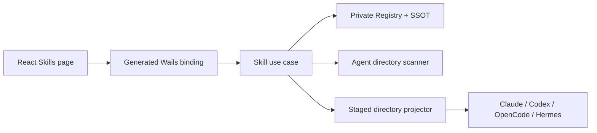

# Skills Registry Design

## Goal

Add a local Skills Registry to BootAgent. It discovers Skills already present in
supported Agent directories, imports Skills from a local folder or ZIP archive,
keeps managed content variants in BootAgent's private directory, and copies selected
content to supported Agents. The first release is deliberately local-only: it
does not download from GitHub or `skills.sh`, run Skill code, or maintain a
remote catalog.

The design follows the useful part of `cc-switch`: Skill content has a single
managed source and each Agent receives a projection. It follows BootAgent's MCP
Registry for the scan, draft, conflict, Apply, write-lock, and Wails-boundary
patterns, but it does not force directory trees into the MCP model or add a
database.

## Scope

The first release supports global user Skills for these Agents:

| Agent | Skills root | Eligibility |
| --- | --- | --- |
| Claude Code | `~/.claude/skills` | command is discoverable and root exists |
| Codex | `~/.codex/skills` | command is discoverable and root exists |
| OpenCode | `~/.config/opencode/skills` | command is discoverable and root exists |
| Hermes | `~/.hermes/skills` (Windows: `%LOCALAPPDATA%\\hermes\\skills`) | command is discoverable and root exists |

The Agent catalog is the source of truth for these paths and support flags. Add
optional `skills_path` and `skills_windows_path` fields to catalog entries; the
four supported entries carry those fields and all other Agents remain without a
Skills contract. React does not carry a second list. A future catalog entry can
add a Skills root without changing the Registry model.

The following are out of scope for this release:

- remote repositories, `skills.sh`, marketplace search, downloads, or update checks;
- project-local Skills and filesystem watchers;
- executing, sandboxing, linting, or health-checking Skill code;
- ZIP export, cloud sync, deep links, OAuth, and persistent page drafts;
- automatic desired-state reconciliation or creating an uninitialized Agent root.

## Architecture



- `internal/skill` owns the content model, validation, tree hashing, folder and
  ZIP preview, private Registry storage, backup storage, and directory copy
  primitives.
- `internal/app` owns Agent eligibility, the process-wide `writeMu`, scan
  reconciliation, Apply orchestration, and the combined dirty-window state.
- `internal/binding` exposes one `SkillService` and small native file/folder
  selection helpers. It does not duplicate business logic.
- The frontend owns drafts, candidate selection, conflict resolution, and
  retry presentation. It calls only generated bindings.

No new dependency is needed. Use the standard library for ZIP handling,
hashing, path checks, and directory traversal; reuse `securefs`, the existing
Wails dialog API, and the repository's YAML parser for bounded `SKILL.md`
front matter.

## Data Model

### Logical and physical identity

A logical Skill ID is the immediate directory name visible to an Agent. It must
match `^[A-Za-z0-9][A-Za-z0-9._-]{0,127}$`; `.` and `..`, path separators,
absolute paths, control characters, and platform-specific reserved names are
rejected at every boundary.

The same logical ID can have multiple content variants. To keep those variants
without inventing a default, the private tree uses deterministic physical
paths:

```text
~/.bootagent/
  skills/
    <id>/
      variants/
        <sha256>/
          SKILL.md
          ...other files...
  skill-registry.json
  skill-backups/
    <timestamp>-<id>-<sha256>/
      content/...
      metadata.json
```

`<sha256>` is the complete lowercase hex tree hash, not a user-provided path.
The Registry computes this path and never accepts a caller-supplied SSOT path.
An unconflicted Skill still uses the same `variants/<hash>` layout, so adding a
second variant does not migrate existing content.

### Registry schema

The writable schema starts at version 1:

```json
{
  "schema_version": 1,
  "skills": {
    "code-review": {
      "name": "Code review",
      "description": "Review a change",
      "variants": [
        {
          "hash": "<64 lowercase hex characters>",
          "stored": true,
          "observed_agents": ["codex"],
          "import_sources": ["folder"],
          "managed_targets": ["claude-code", "opencode"]
        }
      ]
    }
  }
}
```

`observed_agents` records factual Agent associations from the latest successful
scan. `import_sources` records bounded labels such as `folder` or `zip` without
retaining a source filesystem path. `stored` says whether the complete variant
tree currently exists in SSOT. `managed_targets` records the last successful
BootAgent copy for that exact hash. It is used together with a fresh target hash
check before BootAgent removes a directory. Target selections that have not been
applied remain only in React draft state. A scan may report a variant with
`stored: false` when it exists only in an Agent directory; that candidate is not
copied into SSOT until the user imports it and Applies the draft.

`name` and `description` are bounded metadata parsed from optional YAML
front matter in `SKILL.md`; malformed front matter falls back to the logical
ID and a redacted diagnostic. The Registry stores no API-key-specific fields,
but all managed Skill files are treated as private because arbitrary Skill
content can contain secrets.

The Registry file is absent-as-empty. A malformed file or a newer schema is a
diagnostic error and is never overwritten automatically. A valid older schema
may be migrated in memory and written only by an explicit Apply, import, or
repair action.

### Tree hashing and validation

The tree hash is SHA-256 over a stable sequence of relative path, file type,
file length, and file bytes. Relative paths are sorted using slash-separated
UTF-8 names. Directories are traversed without following links. Regular files
and directories are accepted; symlinks, device files, sockets, and other
special entries are rejected. This makes a hash reproducible across Agent
directories and prevents a managed copy from escaping its root.

Each candidate must contain exactly one valid root `SKILL.md` at its Skill
directory. A folder import recursively finds candidate directories; an input
folder that itself contains `SKILL.md` is one candidate. Agent scans inspect
immediate child directories only, matching the global Agent Skills layout.
Candidate and front-matter sizes are bounded before allocation. Invalid
candidates are reported individually and do not abort valid candidates.

## Scan and Reconciliation

`List` loads the Registry and returns only summaries plus pending observation
candidates. `Scan` runs after the
Skills page first renders and on every later page entry; it never runs during
application startup. The UI remains interactive while the scan is in flight.

Within `writeMu`, the use case:

1. loads the previous Registry and calculates eligible Agents from catalog
   metadata, command discovery, platform, and existing Skills roots;
2. removes only the previous factual associations for those eligible Agents;
3. reads each Agent root without creating it or writing it;
4. hashes every valid child Skill and groups equal hashes into one variant;
5. records an Agent as an observation source. Existing SSOT variants retain
   `stored: true`; newly observed variants are returned as import candidates with
   `stored: false` and are not copied or persisted as managed content;
6. removes associations for externally deleted directories, while retaining
   the SSOT variant and its other associations;
7. restores the previous association and emits a redacted diagnostic if an
   Agent root cannot be read or parsed; a read failure is never treated as
   deletion;
8. atomically saves the reconciled Registry, retaining stored variants and the
   redacted observation summary needed to render pending import candidates.

An external content change creates or joins a different variant and clears the
old managed association for that Agent. The row is `conflict` when an ID has
more than one variant. Importing an observation promotes its `stored` flag and
copies the tree into SSOT during Apply. A scan finishing during a dirty draft
replaces factual rows but never replaces the draft; the page marks the source as
changed.

## Draft and Apply

The frontend keeps a map of touched IDs to
`{variant_hash, targets, delete, import_source}`.
There is no backend draft store. A conflict is resolved by selecting one
variant (or a local import candidate) and explicitly choosing target Agents.

An import preview may use a bounded process-private staging directory so ZIP
entries and folder files are not held in the renderer. Staging is temporary,
is not SSOT or Registry state, is removed after Apply/cancel, and is never
reported in ordinary diagnostics. The backend keeps a short-lived opaque token
mapped to the selected source path or staged snapshot in process memory only;
the token is what the renderer sends to Apply. It expires on cancel, timeout,
or process exit and is never persisted.

Before writing anything, `Apply` validates the complete request: IDs, hashes,
target eligibility, source existence, and expected source hashes. For imported
folder/ZIP candidates, Apply re-reads the token's source or staged snapshot and
rejects a changed hash, closing the preview-to-apply TOCTOU window.

For each affected Agent independently:

1. re-read the current Agent Skills root;
2. preserve every unrelated child directory;
3. for a selected stored variant, copy its SSOT tree to a same-parent staging
   directory, validate it, and publish it to `<root>/<id>` by renaming the old
   directory to a private rollback name and then renaming the staged directory
   into place. If the second rename fails, restore the rollback name. A crash
   between those renames can leave a recoverable rollback directory; the next
   scan reports it instead of silently deleting it. This is the platform-safe
   directory equivalent of `securefs` atomic file publication;
4. for a target removal, re-hash `<root>/<id>` and delete it only if the
   Registry records that Agent as managed for the expected hash;
5. update the successful variant's `managed_targets` and atomically persist
   the Registry.

For an unstored Agent observation or local import, the selected source is first
copied into a newly validated `skills/<id>/variants/<hash>` SSOT path using the
same staging/publish sequence. Only after that succeeds can target projection
begin. If SSOT publication fails, no Agent target is touched.

Successes remain applied if another Agent fails. The response contains one
result per Agent with `content_updated`, `registry_updated`, and a localized
safe error code/message. The frontend clears only successful work and leaves
failed targets pending for retry. If content replacement succeeds but Registry
write fails, the result explicitly reports the split state; no risky rollback
is attempted.

### Uninstall and restore

Uninstall is distinct from target removal. It first copies the complete logical
Skill directory (all variants) into `skill-backups`, writes backup metadata, and
only then removes managed Agent projections and the SSOT directory. If backup
creation or metadata permission tightening fails, uninstall stops before any
deletion and removes the incomplete backup. Each target is revalidated before
deletion. A failed or externally changed target remains untouched and keeps the
Registry entry with a partial-failure result. The Registry entry is removed only
after the SSOT removal and all requested managed target removals succeed.

Backups are private, retain the newest 20 entries, and are never pruned while a
restore is running. Restore validates the backup metadata and `SKILL.md`,
copies the selected variant back into SSOT, and requires explicit target choices
before projecting it.

## Import

Native dialogs select either a directory or a `.zip` file. The selected path is
used only by the backend and is not persisted in browser storage. `PreviewImport`
returns candidate ID, name, description, hash, file count, byte count, and
validation diagnostics. It writes neither SSOT nor Registry. Any process-private
staging directory is temporary and is deleted after the preview token expires
or is consumed.

ZIP processing uses `archive/zip` with the following hard limits, matching the
existing local archive safety envelope: 128 MiB compressed input, 10,000
entries, 512 MiB expanded bytes, and 4 KiB symlink targets (symlinks are
rejected rather than materialized). Absolute names, `..` components, duplicate
normalized paths, and special entries are rejected. Folder imports enforce the
same expanded-byte, entry, and path rules.

The user can select multiple valid candidates. Apply re-reads the source and
requires each expected hash to match the preview. A collision with an existing
ID is represented as another variant; the user must choose which hash to target
or use a new valid ID before Apply.

## Wails API

`binding.Services` gains `Skill *SkillService`; the desktop entry registers it
with the same application service options as MCP. Generated bindings are
regenerated after DTO changes. Generated files are never hand edited; update
`frontend/src/backend/wails.ts` and `frontend/src/types/api.ts` to match.

The service surface is:

```text
List() -> SkillRegistrySummary
Scan() -> SkillScanResult
Get(id) -> SkillDetail
PreviewImport(request) -> SkillImportPreview
Apply(request) -> SkillApplyResult
Uninstall(id) -> SkillUninstallResult
ListBackups() -> []SkillBackupSummary
RestoreBackup(id, targets) -> SkillApplyResult
SetDraftState(dirty, locale) -> error
```

`request` contains a source kind (`agent`, `folder`, or `zip`), a short-lived
source token when applicable, selected candidate IDs, expected hashes, variant
hash, target Agent IDs, and explicit delete/remove flags. Paths are selected by
the native dialog or injected only in tests, validated at the Go boundary, and
never persisted or joined with an untrusted logical ID.

`SetDraftState` contributes to one shared dirty flag with MCP: the native close
guard prompts when either MCP or Skills has an unapplied draft, and clears both
only after the user confirms discard. Locale is shared, with the latest
non-empty page locale winning. The existing `TransferService` pattern is reused
for native selection helpers; tests inject dialog callbacks. Browser/server fake
runners expose the same DTOs without opening native dialogs.

## Frontend

Add `/skills` and a sidebar item using Chinese source keys first, with matching
English translations. The page is a dense table with search, Agent/status
filters, scan indicator, import actions, backup access, and a footer Apply
action. Row actions are inspect, resolve conflict, remove target, and uninstall.

Import and conflict dialogs show candidate metadata and hash differences but no
full arbitrary file contents by default. A detail action may show bounded
`SKILL.md` text; it never places the entire Skill tree or source path in global
state. Route navigation is blocked while dirty, and the existing native close
guard reports only the boolean dirty flag and locale.

## Error and security boundaries

- Do not create an Agent root during scan or eligibility calculation.
- Never follow source or target symlinks during hashing, copy, or deletion.
- Keep the old target and old Registry when staging, validation, permission, or
  rename fails; retain a rollback directory for post-crash recovery and surface
  it on the next scan.
- Use `securefs` private-directory, backup, same-directory temporary, permission
  tightening, and atomic-replace order for Registry and backup metadata.
- Redact source paths, file contents, and error details that could contain
  secrets. Return stable error categories for invalid input, source changed,
  conflict, permission, and retryable filesystem failure.
- A user cannot cause deletion outside an eligible Agent Skills root with a
  logical ID or archive entry.

## Testing and verification

### Go

- model tests for ID/path validation, deterministic hashing, front matter
  limits, conflict grouping, and Registry migration;
- archive and directory tests for traversal defense, limits, duplicate paths,
  symlink rejection, atomic replacement, backups, retention, and restore;
- use-case tests for eligibility, scan candidate-vs-SSOT retention/deletion, import revalidation,
  Apply partial success, managed-target deletion, uninstall, and write-lock
  serialization;
- binding tests for method allowlists, cancellation, injected dialogs, and
  redacted DTOs.

### Frontend

Vitest tests cover background scan rendering, candidate selection, conflict
resolution, target edits, dirty state, Apply partial success/retry, and route
blocking. One browser E2E flow covers local folder import plus Apply; a second
covers an external conflict and explicit resolution using fake bindings.

### Repository gates

Run `go test ./...`, `go test -race ./...`, `go vet ./...`, the frontend frozen
install/test/build/E2E commands, `python3 scripts/check-docs.py`, and the
release/license checks. Any new distributed dependency or UI third-party mark
must update `NOTICE`; this design intentionally adds none.

## Acceptance criteria

1. A fresh machine with no Agent Skills roots sees an empty page and no newly
   created Agent directories.
2. Scanning an initialized Agent discovers valid Skills without changing its
   files; an unmanaged discovery appears as an import candidate and is not
   copied to SSOT until Apply. Known facts are preserved when that Agent is unreadable.
3. Equal content across Agents is one synced variant; differing content is a
   visible conflict with no automatic winner.
4. Folder and ZIP preview never writes; Apply revalidates hashes before import.
5. Apply copies only selected variants, preserves unrelated Agent Skills, and
   reports partial failures without losing successful work.
6. Removing a target cannot delete an externally changed or unowned directory.
7. Uninstall creates a private backup before deleting managed content and
   restore can recreate SSOT content.
8. No Skill content, source path, or secret appears in ordinary status, logs,
   browser storage, or generated test artifacts.
